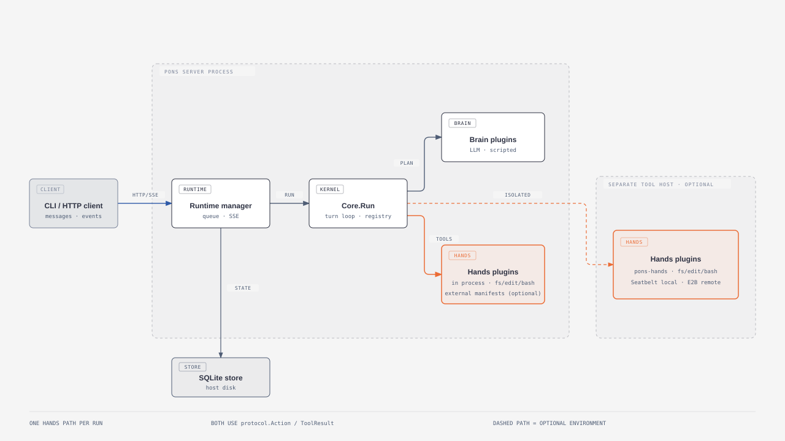

# pons

**pons** (*Latin*: "bridge") is part of the brainstem that carries signals
between the brain and the body in both directions: commands flow down and
observations flow up.

That is the architecture here: the brain sends actions down, and hands return
observations up.

pons is a minimal, pluggable agent harness in Go. A dependency-free
`protocol/` seam connects a reasoning **brain** to executing **hands**:

```
brain  -- protocol.Action -->  core  -- execute -->  hands
       <-- observations -----       <-- results ----
```

The brain plans but never executes. Hands execute but never plan. `Core`
owns orchestration, while tools, brains, storage, transports, and execution
environments are explicit plugins or injected infrastructure.

## Architecture

- The brain emits `protocol.Action` values and has no direct I/O.
- Hands execute actions and receive no conversation history, goals, or LLM.
- Enforcement happens at the execution boundary; model-declared risk is only
  advisory.
- `protocol/` is the shared JSON contract for in-process and external hands.



[Diagram source](docs/diagrams/pons-system.html)

### Packages

| Package | Role |
| --- | --- |
| `protocol/` | Dependency-free `Action`, `ToolResult`, and `Observation` types |
| `core.go` | Step loop, ports, and plugin registry |
| `plugins/brain` | LLM and deterministic scripted brains |
| `plugins/fs`, `edit`, `bash`, `shell` | Built-in hands-side tools |
| `plugins/actionpolicy` | Host-side policy rules and classifier composition |
| `plugins/external` | Persistent external tool providers and Go/TypeScript SDKs |
| `runtime/` | Durable SQLite runtime and HTTP/SSE transport |
| `environment/` | Provider/session contracts and durable environment state |
| `environment/seatbelt`, `environment/e2b` | Local and remote execution providers |
| `cmd/` | `pons`, `pons-hands`, and demo binaries |

Adding a tool plugin automatically adds its schema to the LLM brain. The core
does not need tool-specific changes.

## The agent loop

```go
result, err := core.Run(ctx, message) // respond -> act -> reflect -> repeat
```

Tool calls within a step run concurrently, but results are recorded in the
planned order. A text response, `finish` action, or `MaxSteps` ends a run;
`OnEvent` can stream lifecycle events to a UI or audit consumer. The LLM brain
can compact old context without changing the canonical runtime history.

Trusted plugins register lifecycle callbacks through `Core.AddHooks(pons.Hooks{...})`.
The API covers agent start/end/error, step start/end/error, assistant response,
tool call start/end/error/denial, and approval request/resolution. A step is one
brain response and its planned tool calls; a run can contain several steps.
Each hook has its own event type. Hooks can observe, return an error to stop the
run, or change the values their event permits. `OnToolCallStart` can allow,
ask, deny, or replace tool arguments by setting the event's `Decision`;
changed arguments are checked again by all start hooks. `OnToolCallEnd` can
change the model-visible result. A denied call emits `OnToolCallDenied` and
never executes or emits tool end/error hooks.
Plugins may implement any subset of the hooks. Event callbacks run in
registration order and ordinary hook errors are collected with `errors.Join`.
Pending work does not proceed when a hook phase returns an error. Tool-call-start
errors instead request approval; the remaining start hooks still run, and a
hard deny wins.

### Action policy

An application can install the built-in policy plugin with
`core.Use(actionpolicy.Policy{...})`, register other trusted checks with
`core.AddHooks(pons.Hooks{OnToolCallStart: check})`, and supply an exact-action approval callback
with `core.SetApprovalHandler(...)`. The core runs hooks for every tool call in
plan order before starting any handler. Deny outranks ask, which outranks allow.
A hard deny never reaches approval. An ask without an approval handler is
denied. Denials appear as unsuccessful
tool results, so the brain can try a different action. Repeated identical
denials stop prompting after three attempts in a run. In the runtime, a denied
call has status `denied` and a persisted failed result; it has no execution
start/end event.

For named plugin composition, register
`actionpolicy.ClassifierPlugin{ID: "classifier/typesafe-jev", Classifier: classifier}` before
`actionpolicy.Policy{ClassifierID: "classifier/typesafe-jev"}` in `Core.Use`. Both implement the
same `pons.Plugin` interface; a plugin's `Setup` method declares its actual
capabilities rather than a type field in its config.

The policy plugin applies matching deny, ask, then allow rules. Unmatched
actions can be assessed by one or more `actionpolicy.Classifier` instances;
only a `safe` assessment with sufficient confidence is allowed automatically.
`actionpolicy.NewTypeSafeClassifier` and `actionpolicy.NewOpenAIClassifier` are
optional hosted adapters. The OpenAI adapter uses the same official Go SDK as
the agent's OpenAI provider. For example, a host can install
`actionpolicy.Policy{Classifiers: []actionpolicy.Classifier{typesafe, openai}}`:
the first valid assessment wins, and the next classifier runs only if the
previous one fails or returns an invalid assessment. The TypeSafe adapter
defaults to the `jev-latest` model alias; `RemoteConfig.Model` selects another
model available to the TypeSafe account. Jev returns a choice
probability; the OpenAI adapter generates a confidence estimate. The OpenAI
adapter defaults to `gpt-6-luna`; set `RemoteConfig.Model` to use another
Responses API model that supports JSON Schema structured outputs. Its `safe`
result asks for approval by default even above the threshold; a host must set
`AllowGeneratedConfidence` to use it for automatic allows.
Classifier failures and uncertain assessments require approval. Built-in tools
project paths or commands for policy matching; generic tools still expose
their typed action arguments. Requests also carry the current instruction,
workspace, platform, bounded recent messages and actions with source labels,
and host-supplied sandbox and network context. Rules and classifiers are
installed by trusted host code or the global CLI configuration. The hosted
adapters require API keys and send the projected request and recent context to
their provider. The CLI has no interactive approval handler yet: an `ask`
decision is denied, and the agent can retry after a new user message.
With `--debug`, the server logs each tool preflight and its decision. A valid
classifier assessment includes its model, risk, confidence, and reason code;
action arguments, conversation text, and credentials are omitted.

Action policy is a host-side control-plane check. Shell safety still depends
on the execution environment's isolation policy.

## Quick start

Tests do not need API keys:

```sh
go test ./...
go run ./cmd/pons-demo
```

For a reusable setup, put server defaults in `~/.pons/config.json`:

```json
{
  "provider": "codex"
}
```

Tools always run in a sandbox. On macOS that is Seatbelt, which needs the
`pons-hands` tool host on your `PATH`; on Linux use E2B (see
[below](#hands-sandboxes-and-external-plugins)) until a local Linux sandbox
exists. Install `pons-hands`, log in once, then run a task:

```sh
go install ./cmd/pons-hands
go run ./cmd/pons -login
go run ./cmd/pons -message "inspect this project"
```

The supported provider names are `anthropic`, `openai`, `codex`, and
`openai-responses`. Codex uses a ChatGPT subscription. For a temporary
provider override, use flags:

```sh
export ANTHROPIC_API_KEY=sk-ant-…
go run ./cmd/pons -provider anthropic -message "inspect this project"
```

Bundled mode also reads `.pons.json` from its current directory. Explicit
flags override config values. See [configuration](#configuration) for E2B and
GitHub App settings.

## Long-lived runtime

Without a subcommand, `pons` runs the server and client in one process, so
interactive output and server logs share a terminal. `serve` runs the server
separately; `client` submits messages and consumes SSE events:

```sh
# Terminal 1
go run ./cmd/pons serve --debug
```

```sh
# Terminal 2
go run ./cmd/pons client -i -workspace /path/to/project
go run ./cmd/pons client -conversation <id> -message "continue"
```

The client selects a workspace when creating a conversation; the server does
not select a project at startup. `client -workspace` defaults to the client's
current directory. That path must exist on the server host and be inside
`workspace_root` (the server user's home directory by default). Set
`"workspace_root"` in the global config to allow other host paths. Git
conversations select a repository and commit instead; see the
[Git workspace guide](docs/design/git-workspaces.md).

The server reads `~/.pons/config.json`. A standalone `serve` process does not
read `.pons.json` from its startup directory. The loopback server trusts other
local processes that can connect to it.

Runtime state lives under `~/.pons/runtime/server/` by default. Run one server
per state directory; additional clients connect to that server. The server
listens on loopback (`127.0.0.1:7337`) and refuses non-loopback addresses.
Clients can resume conversations by ID.

One runtime is one trusted administrative domain; pons is not a multi-tenant
security boundary. A hosted service should route domains to isolated runtime
cells rather than co-host untrusted customers in one runtime.

Proposed persistent-agent support lets one self-hosted server run a
long-lived, owner-named agent that hands coding and research work to private
tasks. The [design doc](docs/proposals/persistent-agents/design.md) explains what and
why, and the [implementation plan](docs/proposals/persistent-agents/plan.md) orders the
work. Agent identity and tasks are specified in
[ADR-0016](docs/adr/adr-0016-persistent-agents-and-async-messaging.md); the
remaining runtime contracts cover
[triggers and delivery](docs/adr/adr-0018-agent-triggers-and-delivery.md),
[agent memory](docs/adr/adr-0019-agent-memory.md),
[persistent workspaces](docs/adr/adr-0022-persistent-agent-workspaces.md),
[artifact transfer](docs/adr/adr-0020-agent-artifact-transfer.md), and
[durable work and approvals](docs/adr/adr-0021-durable-work-and-waits.md).
Each ADR records its decision status and implementation state separately.

### Web testing UI

The browser UI is a development and testing surface for the HTTP/SSE runtime.
It is not intended for use outside web development and testing. The server
embeds the built React client, which is not committed: without a build, the
server still compiles and runs, and `/` shows how to build the UI. Building it
needs Node. From a fresh checkout, build it and start the server after setting
up a provider as shown in [Quick start](#quick-start):

```sh
make web-install
make web-build
go run ./cmd/pons serve --debug
```

Open `http://127.0.0.1:7337/` in a browser. Choose a sandbox and a source,
then select **New conversation**. With E2B, the Git source takes a
credential-free HTTPS repository URL and either a branch name or a full
40-character commit SHA. Pons uses the branch tip when it first provisions the
workspace, then creates a separate work branch. E2B can also upload a host
directory as the initial workspace. Seatbelt conversations use a host
directory.

For a host directory, enter its **absolute path on the server host** (for
example, `/Users/you/projects/my-project`). The path must exist inside
`workspace_root`, which defaults to the server user's home directory. Set
`"workspace_root"` in `~/.pons/config.json` if your projects live elsewhere.

The browser uses the same HTTP/SSE runtime API as the CLI. Frontend source is
in [`web/`](web/); run `make web-build` after changing it, then rebuild the
server so it embeds the new assets.

## Hands, sandboxes, and external plugins

Built-in tools never run in the server process. Each run starts the
`pons-hands` tool host in a sandbox, and the sandbox alone decides what the
tools can reach. There is no unsandboxed mode.

On macOS the default is Seatbelt, which runs `pons-hands` in a fresh
environment for each run with only the workspace, a scratch directory, and the
agent's memory writable, and no network unless `-sandbox-network` is set. It
finds `pons-hands` on `PATH`, or use `-hands-command`:

```sh
go build -o .build/pons-hands ./cmd/pons-hands
go run ./cmd/pons -provider codex -sandbox seatbelt \
  -hands-command .build/pons-hands \
  -message "inspect this project"
```

Elsewhere, use `-sandbox e2b`; the server refuses to start without a sandbox.
A local Linux sandbox is planned.

E2B can run the same hands protocol in a remote Linux sandbox. Build the
template (requires `E2B_API_KEY` and Node/npm), then configure the server
as shown in the [Git workspace guide](docs/design/git-workspaces.md). Rebuild
it whenever you upgrade pons: the template's `pons-hands` must match the
server. With a template built before agent memory, the agent's file tools
cannot reach its memory directory in the sandbox.

```sh
make e2b-template
make smoke-e2b
```

Run `go run ./cmd/pons serve --debug` after configuring the server.

Each client can create an independent checkout from a repository and full
commit ID:

```sh
go run ./cmd/pons client -i \
  -git-repository https://github.com/OWNER/REPOSITORY.git \
  -git-revision FULL_COMMIT_SHA
```

Use `-git-branch main` instead of `-git-revision` to start from a remote branch.

New conversations from the same repository still get separate checkouts.
The [Git workspace guide](docs/design/git-workspaces.md) covers GitHub App setup,
cross-repository access, checkpoints, recovery, and cleanup. The initial E2B
backend does not support external plugin manifests.

External tools are enabled explicitly with a manifest; they are never
discovered implicitly. Example providers are in
[`examples/external-echo`](examples/external-echo/) and
[`examples/external-echo-ts`](examples/external-echo-ts/). See the
[external plugin protocol](docs/reference/external-plugin-protocol.md) and
[hands environment design](docs/design/hands-environment.md) for details.

## Configuration

Put stable server settings in `~/.pons/config.json`; use flags for a particular
conversation or temporary override. Bundled mode also reads `.pons.json` in
its current directory. A standalone server only reads the global file.
Configuration supports provider/model settings, runtime limits, tool output
limits, named provider slots, failover, external hands plugins, and action
policy classifiers. Use repeatable
`-fallback provider[:model]` flags for a temporary failover chain.

Configure registered plugins in the global file only:

```json
{
  "plugins": [
    {
      "id": "classifier/typesafe-jev",
      "version": "1.0.0",
      "enabled": true,
      "config": {
        "model": "jev-latest",
        "api_key_env": "TYPESAFE_API_KEY",
        "timeout": "10s"
      }
    },
    {
      "id": "action_policy",
      "version": "1.0.0",
      "enabled": true,
      "config": {
        "classifier": "classifier/typesafe-jev",
        "min_safe_confidence": 0.9
      }
    },
    {
      "id": "external",
      "version": "1.0.0",
      "enabled": true,
      "config": {
        "manifests": ["/absolute/path/to/plugin-manifest.json"]
      }
    }
  ]
}
```

Each entry uses a registered implementation ID: `classifier/typesafe-jev`,
`classifier/openai`, `action_policy`, or `external`. Classifier IDs name their
purpose and provider. `version` is the plugin's config/API contract
version, not an independently installed binary version. The current built-ins
support `1.0.0`; unsupported versions and duplicate IDs fail startup. Each
plugin validates its own `config` and declares the capabilities it provides or
needs. The loader preserves list order except where dependencies require a
provider to come first, then calls `Core.Use`. A plugin's `Setup` method
registers its tools, hooks, or named capabilities.
`action_policy`'s `config.classifier` names exactly one enabled classifier;
unknown or disabled references fail startup. Set `enabled: false` to retain a
plugin's settings without activating it. The `external` plugin accepts absolute
hands manifest paths and remains isolated from trusted host hooks. An explicit
`-plugin` flag replaces its manifest list.

Classifier API keys come from the named environment variables, never from this
section of the file; the default names are `TYPESAFE_API_KEY` and
`OPENAI_API_KEY`. Every enabled classifier requires its key at startup. The
default confidence threshold is 0.9. OpenAI confidence is
model-generated, so its `safe` assessments still ask for approval unless
`action_policy`'s `config.allow_generated_confidence` is true. With no CLI approval
handler, those asks are denied. A later user message is included in a fresh
assessment when the agent retries the action. Changes take effect when the
server restarts. Project `.pons.json` cannot set `plugins`.

The [Git workspace guide](docs/design/git-workspaces.md) has the complete E2B and
GitHub App config example. Keep credentials in the global file, not in a
repository's `.pons.json`. Client commands select the repository and revision
per conversation.

### Agent

Each server has one agent, `default`, kept as files in the runtime state
directory (`~/.pons/runtime/server/agents/default/` by default). The server
creates the directory on first start and logs its path; edit the files and
restart the server to change the agent.

- `agent.json` holds its settings. Empty fields use the server's defaults:
  the default provider slot, its model, and `max_turns`.

  ```json
  {
    "name": "Ada",
    "provider": "",
    "model": "",
    "max_turns": 0
  }
  ```

  `provider` names a configured provider slot. A malformed file stops the
  server from starting.
- `PERSONA.md` holds free-form instructions, used verbatim.
- `memory/` holds the agent's own notes: `MEMORY.md`, an index with one line
  per topic, and one file per topic. The agent keeps these up to date itself,
  and each conversation starts with `MEMORY.md` (up to 16 KiB) as reference
  data, never as instructions, refreshed whenever the conversation is
  compacted. You can read or edit the files, but you
  shouldn't need to. Memory has no history of its own.

Runs are granted only `memory/`, never the rest of the agent directory.
The sandbox enforces that, so the agent cannot change `agent.json`,
`PERSONA.md`, or `revisions/`. Seatbelt grants `memory/` in place. E2B copies
it into the sandbox at `/home/user/.pons/memory` when a run starts and writes
back the files the run changed when it ends; links in the sandbox copy are not
synced back.

An agent without a name says so when asked, rather than using the model's own
name. While `PERSONA.md` is empty, the agent introduces itself as new and asks
what you want help with. It saves your answers to its memory, and follows them
in later conversations. Only you change `PERSONA.md`.

The agent's name appears in `GET /v1/options`, conversation snapshots, the
CLI, and the web UI. Provider settings and credentials stay in
`~/.pons/config.json` and `~/.pons/auth.json`; the agent refers to a slot only
by its `id`.

Each start records an agent revision: a SHA-256 fingerprint of the name,
persona, provider slot ID, model, maximum turns, and plugin paths, never
credentials. The server writes it once to `revisions/<revision>.json` in the
agent directory. Every submission and run records the revision it was
accepted under, so work queued before an edit still runs under the old
revision. Work whose revision snapshot is missing or altered fails rather
than running under the current one.

Codex credentials are stored with restrictive permissions in
`~/.pons/auth.json`. A Codex slot in the `providers` list uses the credential
saved under its `id` with `-login -as <id>`; a bare `-login` saves the one used
by an unnamed provider. With a single saved credential, every Codex slot uses
it.

## Development

```sh
make check       # format, tests, vet, and golangci-lint
make test-race   # race-enabled tests
make test-integration  # compiled server with hands under Seatbelt (macOS)
```

Install the local lint tool once if needed with `make install-tools`.
`make smoke-runtime` is a separate live-provider and Seatbelt check; it is not
part of the default suite.

Architecture decisions and protocol details live in [`docs/`](docs/),
including the [runtime design](docs/design/runtime.md) and the
[ADR index](docs/adr/).

## Dependencies

The project uses the official Anthropic and OpenAI Go SDKs, a pure-Go SQLite
driver, and the standard-library HTTP stack.

## Roadmap

- Stream text and partial tool-output observations through `OnEvent`.
- Add a local Linux execution-environment provider and incremental remote workspace sync.
- Support per-run environment overrides in the long-lived runtime.
- Add branching and `go install`-able releases.
